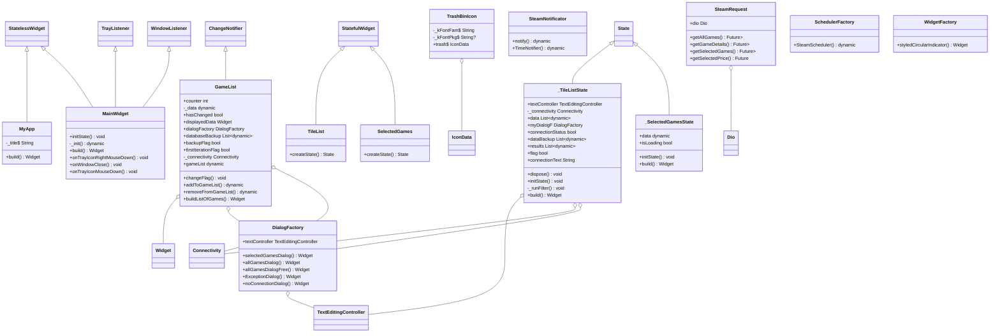

# Class diagram

```mermaid
classDiagram
class MyApp
MyApp : -_title$ String
MyApp : +build() Widget
StatelessWidget <|-- MyApp

class MainWidget
MainWidget : +initState() void
MainWidget : -_init() dynamic
MainWidget : +build() Widget
MainWidget : +onTrayIconRightMouseDown() void
MainWidget : +onWindowClose() void
MainWidget : +onTrayIconMouseDown() void
StatelessWidget <|-- MainWidget
TrayListener <|-- MainWidget
WindowListener <|-- MainWidget

class TileList
TileList : +createState() State<TileList>
StatefulWidget <|-- TileList

class _TileListState
_TileListState : +textController TextEditingController
_TileListState o-- TextEditingController
_TileListState : -_connectivity Connectivity
_TileListState o-- Connectivity
_TileListState : +data List~dynamic~
_TileListState : +myDialogF DialogFactory
_TileListState o-- DialogFactory
_TileListState : +connectionStatus bool
_TileListState : +dataBackup List~dynamic~
_TileListState : +results List~dynamic~
_TileListState : +flag bool
_TileListState : +connectionText String
_TileListState : +dispose() void
_TileListState : +initState() void
_TileListState : -_runFilter() void
_TileListState : +build() Widget
State <|-- _TileListState

class GameList
GameList : +counter int
GameList : -_data dynamic
GameList : +hasChanged bool
GameList : +displayedData Widget
GameList o-- Widget
GameList : +dialogFactory DialogFactory
GameList o-- DialogFactory
GameList : +databaseBackup List~dynamic~
GameList : +backupFlag bool
GameList : +firstIterationFlag bool
GameList : -_connectivity Connectivity
GameList o-- Connectivity
GameList : +gameList dynamic
GameList : +changeFlag() void
GameList : +addToGameList() dynamic
GameList : +removeFromGameList() dynamic
GameList : +buildListOfGames() Widget
ChangeNotifier <|-- GameList

class SteamNotificator
SteamNotificator : +notify() dynamic
SteamNotificator : +TimeNotifier() dynamic

class TrashBinIcon
TrashBinIcon : -_kFontFam$ String
TrashBinIcon : -_kFontPkg$ String?
TrashBinIcon : +trash$ IconData
TrashBinIcon o-- IconData

class SteamRequest
SteamRequest : +dio Dio
SteamRequest o-- Dio
SteamRequest : +getAllGames() Future<List<dynamic>>
SteamRequest : +getGameDetails() Future<Map<dynamic, dynamic>>
SteamRequest : +getSelectedGames() Future<List<dynamic>>
SteamRequest : +getSelectedPrice() Future<String>

class SchedulerFactory
SchedulerFactory : +SteamScheduler() dynamic

class DialogFactory
DialogFactory : +textController TextEditingController
DialogFactory o-- TextEditingController
DialogFactory : +selectedGamesDialog() Widget
DialogFactory : +allGamesDialog() Widget
DialogFactory : +allGamesDialogFree() Widget
DialogFactory : +ExceptionDialog() Widget
DialogFactory : +noConnectionDialog() Widget

class SelectedGames
SelectedGames : +createState() State<SelectedGames>
StatefulWidget <|-- SelectedGames

class _SelectedGamesState
_SelectedGamesState : +data dynamic
_SelectedGamesState : +isLoading bool
_SelectedGamesState : +initState() void
_SelectedGamesState : +build() Widget
State <|-- _SelectedGamesState

class WidgetFactory
WidgetFactory : +styledCircularIndicator() Widget
```